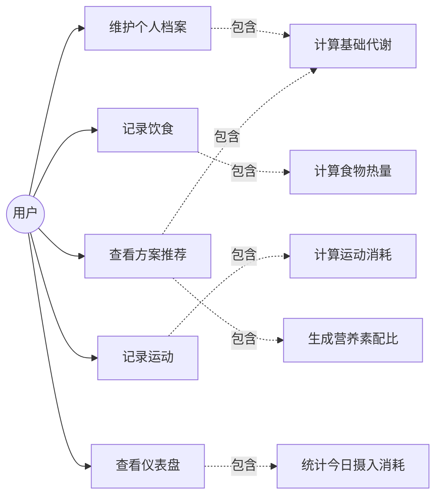

# 用例模型（Use Case Model）

## 1. 用例图

> 说明：本系统为单用户本地应用，仅存在「用户」一个角色，故用例图中只有一个参与者。所有用例围绕「记录—核算—推荐」闭环展开。

## 2. 用例规约

### 用例 1：维护个人档案

| 项 | 描述 |
|----|------|
| 用例编号 | UC-01 |
| 参与者 | 用户 |
| 前置条件 | 系统已启动 |
| 主流程 | 1. 用户进入「个人档案」页；2. 填写/修改性别、年龄、身高、体重、目标体重、活动水平、减脂目标；3. 点击保存；4. 系统持久化并跳转方案推荐页 |
| 后置条件 | 档案保存成功，后续所有计算基于新档案 |
| 异常 | 输入非法（如年龄超范围）→ 前端校验拦截，提示修正 |

### 用例 2：记录饮食

| 项 | 描述 |
|----|------|
| 用例编号 | UC-02 |
| 参与者 | 用户 |
| 前置条件 | 已存在食物库数据 |
| 主流程 | 1. 进入「饮食记录」页；2. 搜索/选择食物；3. 输入克数；4. 点击添加；5. 系统按「每100g热量×克数/100」计算热量并入库 |
| 后置条件 | 饮食记录入库，今日总摄入更新 |
| 异常 | 克数为空或≤0 → 前端拦截提示 |

### 用例 3：记录运动

| 项 | 描述 |
|----|------|
| 用例编号 | UC-03 |
| 参与者 | 用户 |
| 前置条件 | 已存在运动库数据 |
| 主流程 | 1. 进入「运动记录」页；2. 选择运动；3. 输入时长（分钟）；4. 点击添加；5. 系统按「MET×体重×时长」计算消耗并入库 |
| 后置条件 | 运动记录入库，今日总消耗更新 |
| 异常 | 时长为空或≤0 → 前端拦截提示 |

### 用例 4：查看方案推荐

| 项 | 描述 |
|----|------|
| 用例编号 | UC-04 |
| 参与者 | 用户 |
| 前置条件 | 个人档案已保存 |
| 主流程 | 1. 进入「方案推荐」页；2. 系统计算 BMR、TDEE、热量缺口、目标摄入与营养素配比；3. 展示给用户 |
| 后置条件 | 用户获得个性化方案 |
| 异常 | 档案缺失 → 使用默认值计算 |

### 用例 5：查看仪表盘

| 项 | 描述 |
|----|------|
| 用例编号 | UC-05 |
| 参与者 | 用户 |
| 前置条件 | 存在当日或历史记录 |
| 主流程 | 1. 进入「仪表盘」；2. 系统汇总今日摄入、消耗、目标、剩余可摄入；3. 展示近 7 日趋势 |
| 后置条件 | 用户了解热量平衡状态 |
| 异常 | 无记录 → 展示零值与引导文案 |

## 3. 用例与需求追踪

| 用例 | 对应 Vision 需求项 | 对应功能特性 |
|------|-------------------|-------------|
| UC-01 维护个人档案 | N3 | F1 用户与目标管理 |
| UC-02 记录饮食 | N1 | F2 饮食热量记录 |
| UC-03 记录运动 | N2 | F3 运动消耗统计 |
| UC-04 查看方案推荐 | N4、N5 | F5 个性化方案推荐 |
| UC-05 查看仪表盘 | N3、N6 | F4 智能热量核算 |
