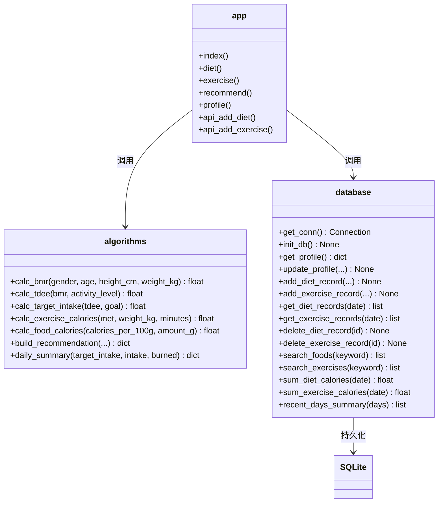
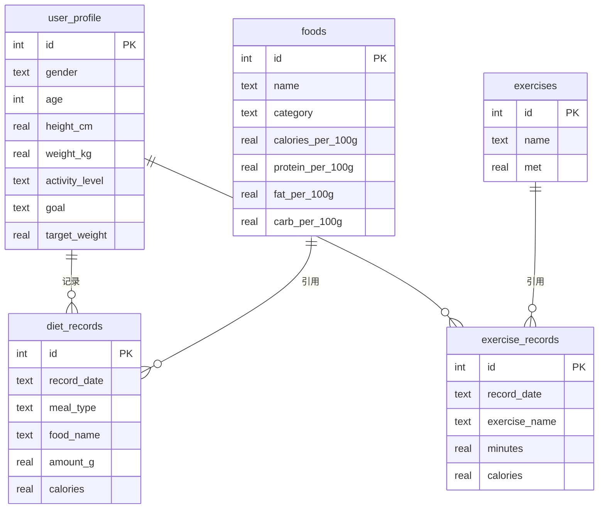
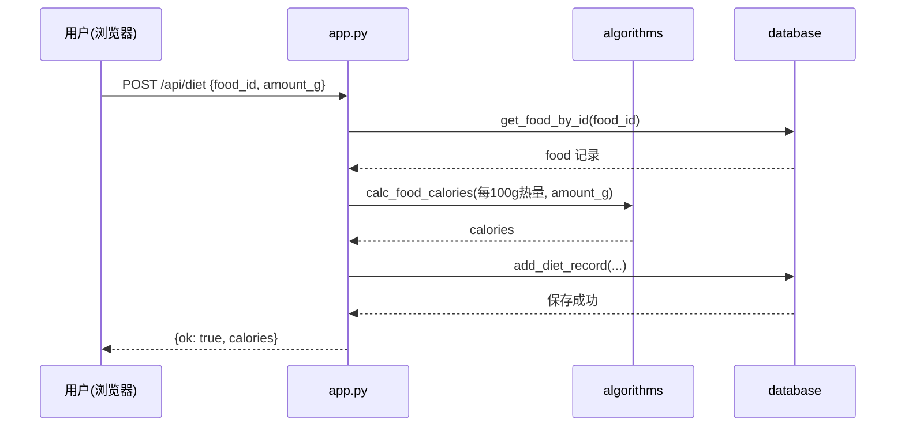

# 设计模型（Design Model）

## 1. 类图

本系统采用分层结构，核心为算法模块 `algorithms.py` 与数据模块 `database.py`，二者解耦，由 `app.py` 编排。

## 2. 数据表结构

## 3. 关键流程时序（记录饮食）

## 4. 设计要点

- **算法与数据解耦**：`algorithms.py` 为纯函数模块，不依赖数据库，可独立单元测试。
- **记录冗余食物名**：饮食/运动记录表冗余存储名称，避免关联查询，适配单用户轻量场景。
- **单用户模型**：`user_profile` 仅维护一行（id=1），简化鉴权与数据隔离。
- **统计实时计算**：热量汇总通过 SQL 聚合即时计算，不落库冗余，保证一致性。
